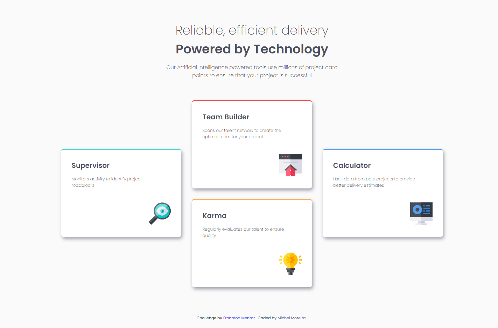
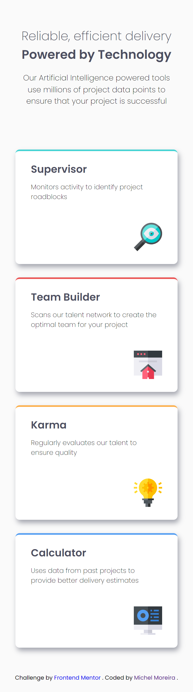

# Frontend Mentor - Four card feature section solution

This is a solution to the [Four card feature section challenge on Frontend Mentor](https://www.frontendmentor.io/challenges/four-card-feature-section-weK1eFYK).

## Table of contents

- [Overview](#overview)
  - [The challenge](#the-challenge)
  - [Screenshot](#screenshot)
  - [Links](#links)
- [My process](#my-process)
  - [Built with](#built-with)
  - [What I learned](#what-i-learned)
  - [Useful resources](#useful-resources)
- [Author](#author)
- [Acknowledgments](#acknowledgments)

## Overview

### The challenge

Users should be able to:

- View the optimal layout for the component depending on their device's screen size

### Screenshot

- Desktop 1440px



- Mobile 375px



## My process

### Built with

- Semantic HTML5 markup
- CSS custom properties
- Flexbox
- Grid

### What I learned

- This project made me learn about semantic HTML5 markup;

- Working with flexible display using the flexbox properties, positioning elements on the screen.

- Working with grid display using the its properties, positioning elements on the screen.

- Working with the BEM methodology to naming classes.

- Working with external fonts (Google fonts) to improve a better custom apparence.

- Working with separated documents, improving organization and responsability to every document with its function in the whole project.

```html
<link rel="stylesheet" href="src/styles/reset.css" />
<link rel="stylesheet" href="src/styles/variables.css" />
<link rel="stylesheet" href="src/styles/style.css" />
<link rel="stylesheet" href="src/styles/responsive.css" />
```

- Working with variables reducing the code and establishing a pattern easiest to manage.

```CSS
:root {
  /* Primary */

  --red: hsl(0, 78%, 62%);
  --cyan: hsl(180, 62%, 55%);
  --orange: hsl(34, 97%, 64%);
  --blue: hsl(212, 86%, 64%);

  /* Neutral */

  --veryDarkBlue: hsl(234, 12%, 34%);
  --grayishBlue: hsl(229, 6%, 66%);
  --veryLightGray: hsl(0, 0%, 98%);
}
```

### Links

- Solution URL: [Add solution URL here](https://your-solution-url.com)
- Live Site URL: [Add live site URL here](https://your-live-site-url.com)

### Useful resources

- [The BEM methodology of naming classes](https://getbem.com/naming/) - This helped me understand how i can use the HTML class attribute in the elements to better naming classes and get them in CSS code more readable. Using proper naming will prepare anyone for the changes in design of the website. I really liked this and will use it going forward.

## Author

- Github - [Michel Moreira](https://github.com/michel-moreira)
- Frontend Mentor - [@michel-moreira](https://www.frontendmentor.io/profile/michel-moreira)
- LinkdIn - [Michel Moreira](https://www.linkedin.com/in/michel-moreira-760142254/)

## Acknowledgments

To the team of users from the Frontend Mentor that helped me with useful suggestions and feedbacks, promoting an excitement and happiness in the matter of coding. To my personal sponsors (family and friends). To everybody that love coding my whole gratitude.
